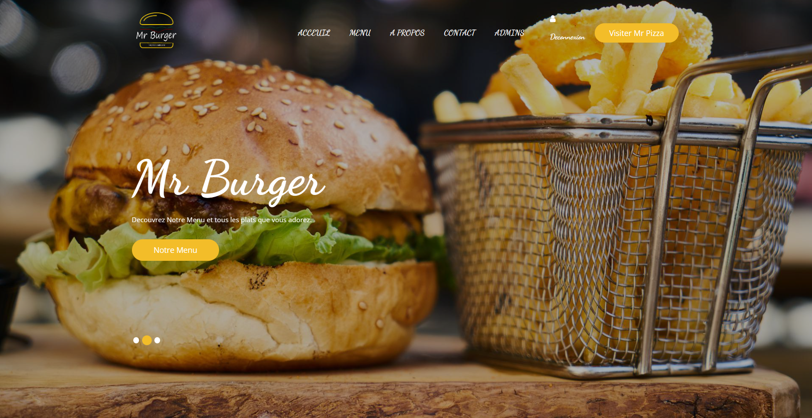
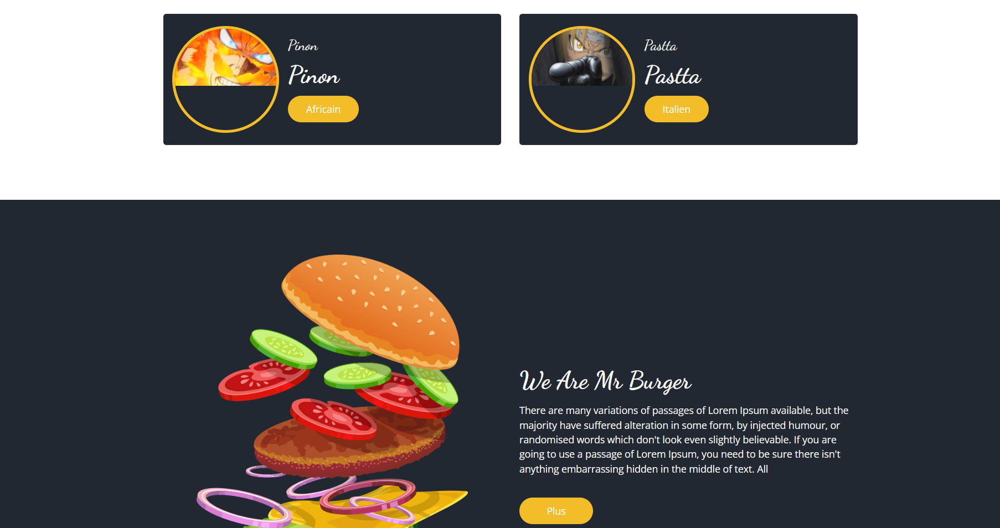
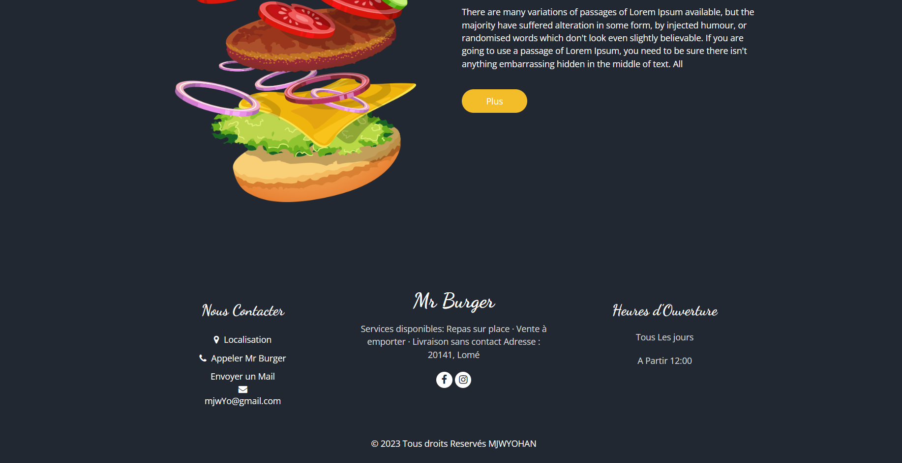
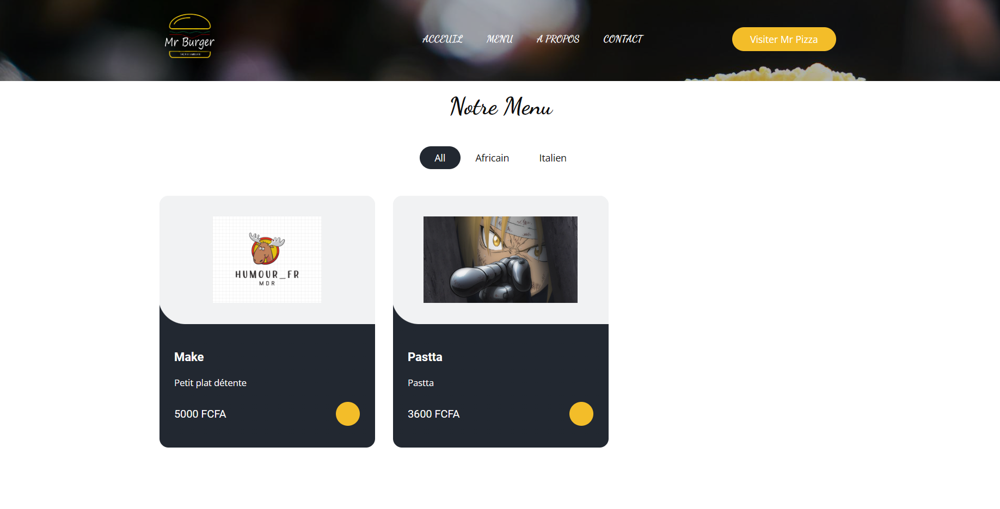
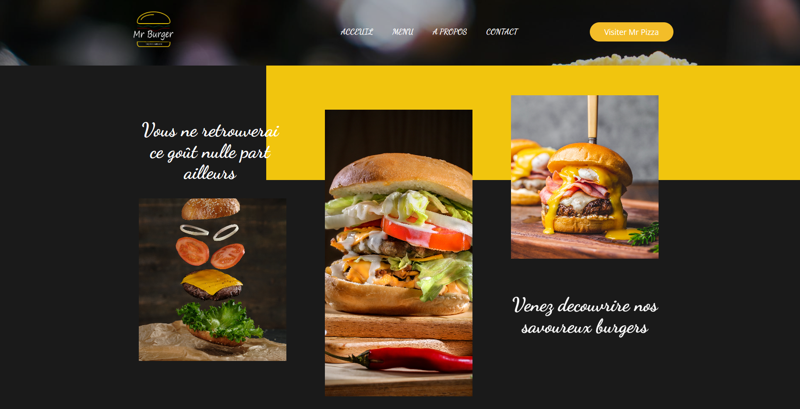
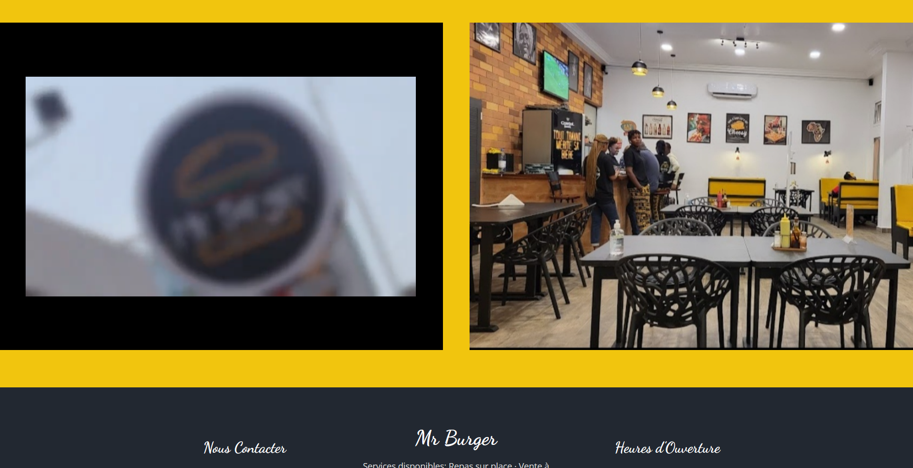
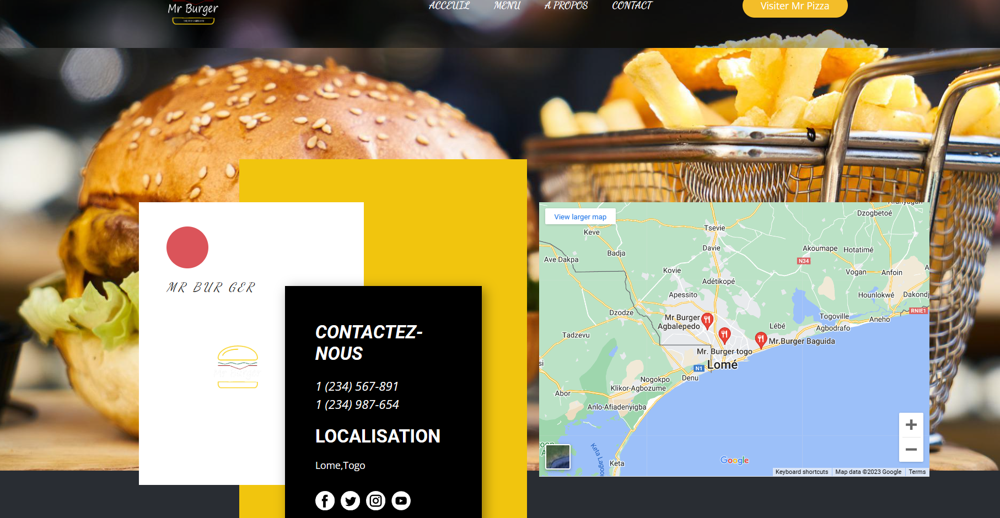

Projet Terminé 
Dynamisation du Trie
Modification de la DB
Fin de La Page Contact 
Ajout du sous Menu Admin

Description : Chili Loco, une application web pour la gestion efficace d'un fast-food. Conçue avec le framework Symfony, utilisant MySQL pour la base de données, et créée à partir de maquettes réalisées sur Figma, l'application permet d'afficher, modifier et supprimer les différents plats disponibles au restaurant. Le développement s'est effectué sous l'éditeur de texte VSCode, offrant ainsi une solution complète pour la gestion quotidienne de Chili Loco.

.
.
.
.
.
.
.
